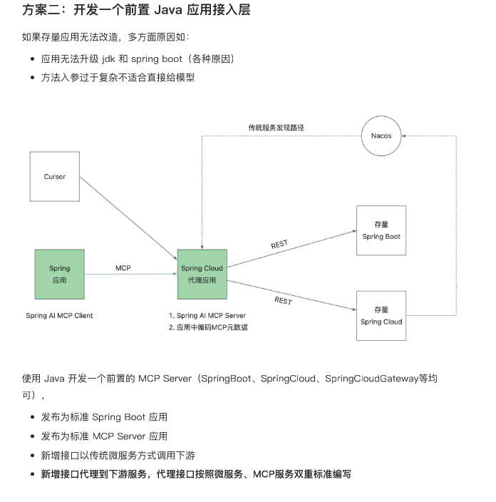

### 方案


方案详解文档：[MCP Gateway](https://ik3te1knhq.feishu.cn/wiki/QrYLwrR45iaKYWkWbSVcrIaHnug)

### 模块讲解

- Restful API提供者
  - mcp-restful：提供时间接口
  - mcp-restful-second：提供天气预测接口
  - mcp-restful-three：提供天气质量接口
- MCP Server
  - mcp-server: 连接了两个服务：mcp-restful和mcp-restful-second  
  - mcp-server-second：连接了1个服务：mcp-restful-three
- MCP Client
  - mcp-client: 连接了两个服务：mcp-restful和mcp-restful-second

### 快速启动
#### 配置nacos

1. 下载nacos：[Nacos Server 下载页](https://github.com/alibaba/nacos/releases)，这里以2.4.2版本为例
2. 初始化数据库表文件：conf\mysql-schema.sql
3. nacos配置文件修改：conf\application.properties

```properties
#*************** Config Module Related Configurations ***************#
### If use MySQL as datasource:
spring.datasource.platform=mysql

### Count of DB:
db.num=1

### Connect URL of DB:
db.url.0=jdbc:mysql://127.0.0.1:3306/nacos?characterEncoding=utf8&connectTimeout=1000&socketTimeout=3000&autoReconnect=true&useUnicode=true&useSSL=false&serverTimezone=UTC&allowPublicKeyRetrieval=true
db.user.0=root
db.password.0=root

### Connection pool configuration: hikariCP
db.pool.config.connectionTimeout=30000
db.pool.config.validationTimeout=10000
db.pool.config.maximumPoolSize=20
db.pool.config.minimumIdle=2
```

**注意：不开启在 2.4.2 中会出现登陆失败异常！**

```properties
### The auth system to use, currently only 'nacos' and 'ldap' is supported:
nacos.core.auth.system.type=nacos

### If turn on auth system:
nacos.core.auth.enabled=true
```

#### 设置服务端验证 key

```properties
nacos.core.auth.server.identity.key=test
nacos.core.auth.server.identity.value=test
```

#### 设置默认 token

```properties
### The default token (Base64 String):
nacos.core.auth.plugin.nacos.token.secret.key=SecretKey012345678901234567890123456789012345678901234567890123456789
```

### mcp-restful启动
提供了restfule接口服务：http://localhost:18086/echo/nacos


### mcp-server启动
网关代理：http://localhost:18085/gateway/echo/nacos
